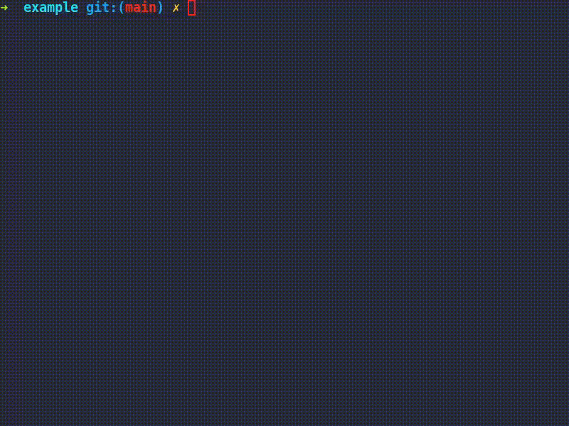

<h1>license</h1>

[license](https://github.com/ycd/license/) is a command-line license generator.

## Installation

None yet.

### Packages

None yet.

### Downloads

None yet.

### Compilation

license is written in [Rust](https://www.rust-lang.org).
You will need rust version [1.45.0](https://blog.rust-lang.org/2020/07/16/Rust-1.45.0.html) or higher.

To build, download the source code and run:

    $ cargo check
    $ cargo install --path .

### TODO

* [ ] Add tests
* [ ] Reduce binary size, which is 6 MB at the moment.
* [ ] Package it for arch linux
* [ ] Distribute the pre-compiled executable binary for different targets such as 64-bit Windows, macOS, and Linux.

## Licence

license source code is licenced under the [MIT](https://www.mit.edu/~amini/LICENSE.md).